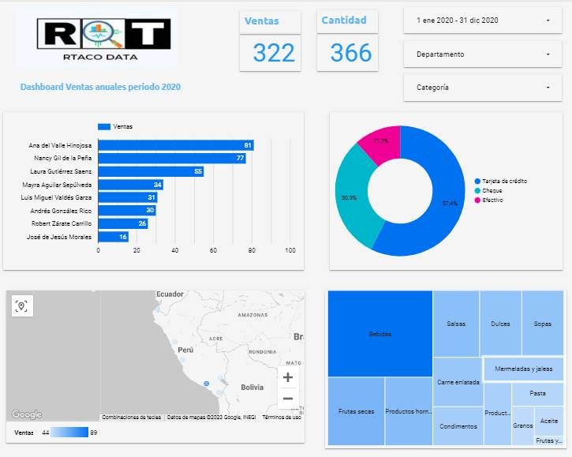

# Dashboard of Sales Looker Studio R&T DATA

Link: https://lookerstudio.google.com/reporting/7b232e9b-c157-427a-8dee-4012432642e5/page/7IlTD

# Targets

* Gráfico de barras de las ventas y vendedores.
* Gráfico circular de la Forma de Pago.
* Mapa de burbujas con los Departamentos.
* Gráfico de rectángulos de Categorías ( Ej. bebidas, dulces,etc.)
* Filtro por período con fecha 2020.
* Lista desplegable de Categoría y Departamento.
* Cuadro de resultados sobre Ventas y Cantidad.

## Screenshot

